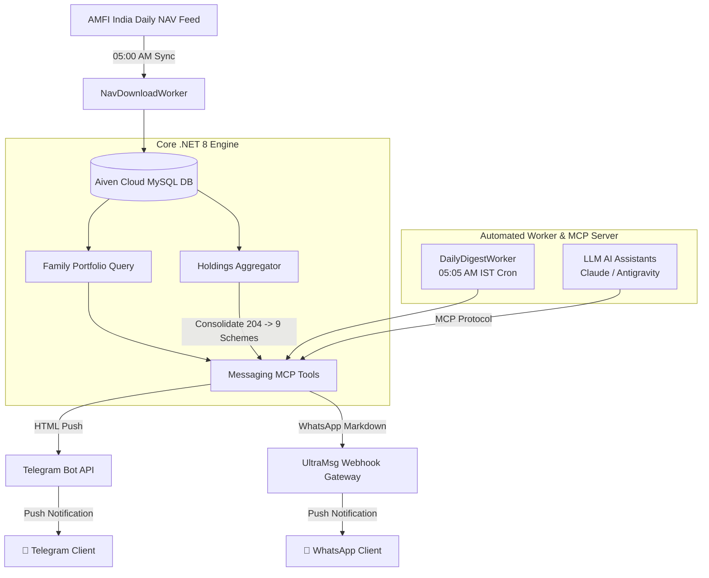

# 📊 MutualFundConsolidated — Enterprise Mutual Fund Platform & AI MCP Gateway

[](https://dotnet.microsoft.com/)
[](https://angular.io/)
[](https://modelcontextprotocol.io)
[](https://aiven.io/)
[](https://render.com/)
[](https://ultramsg.com/)

An enterprise-grade, clean architecture financial portfolio tracking engine and **Model Context Protocol (MCP)** server. The platform ingests daily AMFI market data, calculates scheme-wise portfolio analytics (XIRR, Net P&L, Live NAV, Avg Purchase NAV), and automatically pushes rich morning digests with 24-bit color profit/loss badges to **Telegram** and **WhatsApp** every day at **05:05 AM IST**.

---

## 📐 System Architecture



---

## ✨ Key Features

- **🤖 Model Context Protocol (MCP) Integration**:
  Exposes portfolio analytics, scheme breakdowns, and messaging tools directly to LLM AI Assistants via standardized MCP endpoints.

- **📊 Consolidated 9-Scheme Portfolio Aggregator**:
  Reduces 200+ raw holdings into 9 consolidated mutual fund schemes, calculating Current Value, Invested Capital, Net Profit %, Today's P&L, Live NAV, and Average Buy NAV.

- **📱 Multi-Channel Push Gateway**:
  - **Telegram Bot (`@my_mf_digest_bot`)**: Free instant push notifications.
  - **WhatsApp (`UltraMsg Webhook`)**: Mobile-formatted Markdown digests with solid 24-bit color badges (`🟩` Profit / `🟥` Loss) and shaded monospace data cards (`<code>...</code>`).

- **⏰ Resilient 05:05 AM IST Daily Scheduler**:
  Cross-platform `DailyDigestWorker` background service supporting **Asia/Kolkata** (Linux/Render) and **India Standard Time** (Windows) with automatic cold-start catch-up logic.

---

## 🛠️ Project Structure

```text
C:\MutualFundConsolidated\
├── MutualFund.ConsolidatedAPI/     # Main Monolith Web API & Hosted Services
│   ├── Modules/
│   │   ├── Auth/                   # JWT & User Access Management
│   │   ├── Investment/             # Portfolio & Holdings Queries
│   │   ├── Nav/                    # Automated AMFI NAV Ingestion Worker
│   │   ├── Scheme/                 # Scheme Enrollment & Catalog
│   │   └── Messaging/              # Telegram, WhatsApp & DailyDigestWorker
│   └── Program.cs
├── MutualFund.Mcp.API/             # Standalone MCP Messaging Gateway API
│   ├── Controllers/
│   ├── Jobs/
│   ├── Services/
│   ├── Tools/
│   └── Dockerfile
└── MutualFundShell-Web/            # Angular 18 Single Page Application
```

---

## ⚡ API Endpoints Reference

| Endpoint | Method | Description |
|---|---|---|
| `/api/mcp/digest/preview` | `GET` | Generates a live mobile-formatted daily digest HTML preview |
| `/api/mcp/digest/send?channel=telegram` | `POST` | Dispatches the daily digest to Telegram chat |
| `/api/mcp/digest/send?channel=whatsapp` | `POST` | Dispatches the daily digest to WhatsApp via UltraMsg |
| `/api/nav/sync` | `POST` | Triggers immediate AMFI NAV market data synchronization |

---

## ⚙️ Configuration & Environment Variables

Create or set the following settings in `appsettings.json` or Render Environment Variables:

```json
{
  "ConnectionStrings": {
    "DefaultConnection": "Server=mysql-host.aivencloud.com;Port=26779;Database=defaultdb;User=avnadmin;Password=YOUR_PASSWORD;SslMode=Required;"
  },
  "Telegram": {
    "BotToken": "YOUR_TELEGRAM_BOT_TOKEN",
    "ChatId": "YOUR_TELEGRAM_CHAT_ID"
  },
  "WhatsApp": {
    "Provider": "UltraMsg",
    "UltraMsgInstanceId": "YOUR_ULTRAMSG_INSTANCE_ID",
    "UltraMsgToken": "YOUR_ULTRAMSG_TOKEN",
    "ToPhone": "YOUR_PHONE_NUMBER"
  }
}
```

---

## 🚀 Running Locally

```bash
# Clone repository
git clone https://github.com/shafiq0225/MutualFundConsolidated.git
cd MutualFundConsolidated

# Build and run main Consolidated API
dotnet build MutualFund.ConsolidatedAPI/MutualFund.ConsolidatedAPI.csproj
dotnet run --project MutualFund.ConsolidatedAPI/MutualFund.ConsolidatedAPI.csproj
```

---

## 📄 License
This project is open-source under the [MIT License](LICENSE).
